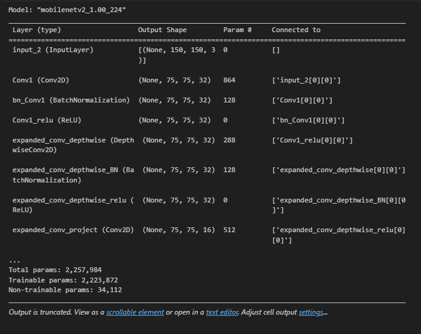
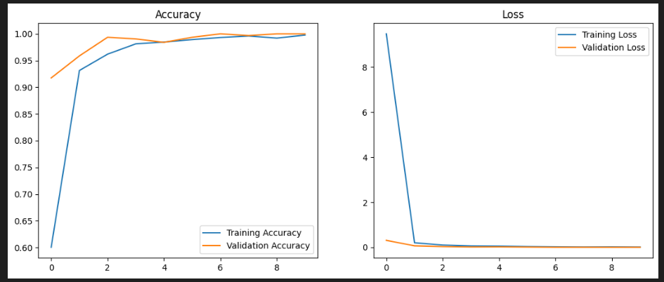
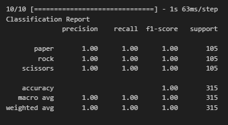
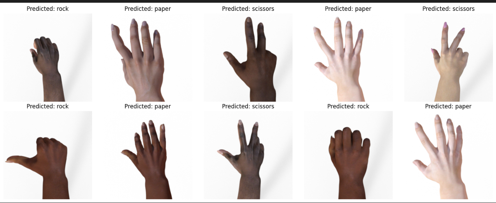

# MODUL 6 - Web Deployment

## Overview

Project ini adalah untuk tugas pratikum mata kuliah Machine Learning Fakultas Teknik Informatika UMM

Preprocessing yang digunakan : Konversi mode warna, Pengubahan ukuran, Konversi ke array, Ekspansi dimensi, Normalisasi

Model yang digunakan : 

MobileNetV2

*Akurasi* yang didapatkan dengan menggunakan model ini adalah : *100%*

## Overview Dataset

*Link Dataset yang digunakan :* [rps dataset](https://drive.google.com/drive/folders/1kgyN9Ah_w6MvxsRxANh3TfB9S-bCVZMv).
Gambar yang digunakan adalah Rock, Paper dan Scissors dengan total gambar 2.520 gambar. Terdiri dari 840 gambar jenis Rock, 840 gambar jenis Paper dan 840 gambar jenis Scissors

Splitting Dataset : Training = 70%, Validation = 25%, Testing = 5%.

## Preprocessing dan Modelling

- *Preprocessing Model* : resize(150,150), rescale=1./255, rotation_range=40, zoom_range=0.2, horizontal_flip=True,

- *Modelling Model* :

  Summary Model :

  

  Graph Loss dan Accuracy :

  

  Evaluation Matrix Model :

  

  ## Predict Data

- Predict Data dengan Model :

1. 

## Local Development

